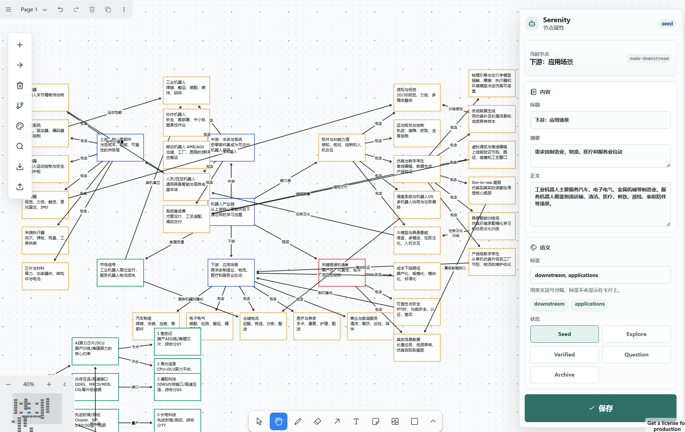

# Serenity Learning Canvas

[](https://react.dev/)
[](https://www.typescriptlang.org/)
[](https://vite.dev/)
[](https://www.tldraw.com/)
[](./LICENSE)
[](https://linux.do/)

> 中文 | [English](#english)

## 目录

- [项目简介](#项目简介)
- [项目展示](#项目展示)
- [功能特性](#功能特性)
- [环境依赖](#环境依赖)
- [快速安装](#快速安装)
- [使用示例](#使用示例)
- [配置说明](#配置说明)
- [常见问题](#常见问题)
- [开源协议](#开源协议)
- [联系方式](#联系方式)
- [English](#english)

## 项目简介

Serenity Learning Canvas 是一个面向人机协作学习与研究的本地无限画布应用。用户可以用卡片和语义连线组织知识结构，AI 或 MCP 客户端可以读取结构化上下文，并通过受约束的 AI Patch 或 Obsidian Markdown 导入导出流程更新画布。目的是为了深度研究，在skills中还内置了X大神Serenity的工作流和数据源，让你的agent直接使用即可

| 项目 | 信息 |
|---|---|
| 项目名称 | Serenity Learning Canvas |
| 项目用途 | 本地知识画布、学习地图、行业研究地图、AI 可读上下文与安全 Patch 协议 |
| 技术栈 | React 19, TypeScript, Vite, tldraw, Node.js, MCP SDK, Vitest |

## 项目展示




## 功能特性

- 无限画布：基于 tldraw，支持缩放、拖拽、选择、编辑、箭头和连线。
- 学习卡片：每张卡片包含标题、摘要、正文、标签、状态和 AI 可读 metadata。
- 语义连线：支持 `contains`、`causes`、`supports`、`questions`、`blocks`、`related` 等关系类型。
- AI Context：将当前画布导出为 AI 可读的结构化节点、边、邻域和 Mermaid 图。
- AI Patch：使用 JSON Patch 风格操作安全地新增、更新、删除、连接、断开或移动节点。
- Obsidian Markdown：支持 vault-ready Markdown 导出与导入，包含 frontmatter、wikilink、tags 和 Mermaid。
- 本地保存：通过 Node 本地存储 API 将画布快照保存到 `store/canvas-default.json`。
- MCP Server：提供本地 stdio MCP 服务，方便 agent 读取上下文、导出 Markdown、校验和应用 Patch。

## 环境依赖

请确保本机已安装：

- Node.js 20 或更高版本
- npm 10 或更高版本
- Git

可选依赖：

- Obsidian，用于查看导出的 Markdown 知识库文件
- 支持 MCP 的 agent 客户端，用于连接 Serenity MCP Server

## 快速安装

```bash
git clone https://github.com/Waldmeinsamkeit/Serenity-map
cd serenity
npm install
npm run dev
```

启动后默认访问：

- 前端应用：`http://localhost:5173/`
- 本地存储 API：`http://localhost:8787/`

Windows 用户也可以在安装依赖后双击：

```text
start-serenity.bat
```

## 使用示例

### 启动开发环境

```bash
npm run dev
```

该命令会同时启动 Vite 前端服务和本地存储 API。

### 单独启动前端

```bash
npm run dev:vite
```

仅启动前端时，应用可以打开，但不会写入本地 `store/` 快照。

### 单独启动本地存储 API

```bash
npm run store
```

### 启动 MCP Server

```bash
npm run mcp
```

MCP 客户端配置示例：

```json
{
  "mcpServers": {
    "serenity": {
      "command": "node",
      "args": ["E:\\repo\\serenity\\scripts\\serenity-mcp.mjs"]
    }
  }
}
```

### AI Patch 示例

```json
{
  "version": 1,
  "intent": "Add a research node",
  "operations": [
    {
      "op": "addNode",
      "id": "node-example",
      "title": "Example Node",
      "summary": "Short visible summary",
      "body": "Detailed AI-readable notes.",
      "tags": ["example"],
      "status": "exploring",
      "x": 120,
      "y": 120
    }
  ]
}
```

### 构建与测试

```bash
npm run build
npm test
```

## 配置说明

### 端口配置

本地存储 API 默认使用 `8787` 端口。可以通过环境变量覆盖：

```bash
SERENITY_STORE_PORT=8790 npm run dev
```

Windows PowerShell 示例：

```powershell
$env:SERENITY_STORE_PORT="8790"
npm run dev
```

### 本地数据目录

画布快照默认保存到：

```text
store/canvas-default.json
```

`store/` 是本地用户数据目录，默认不建议提交到 Git。

### 不建议提交的文件

```text
node_modules/
dist/
.npm-cache/
.env
store/
reports/
*.log
*.err
```

## 常见问题

### 页面刷新后画布为空怎么办？

请确认同时启动了本地存储 API：

```bash
npm run dev
```

如果只运行 `npm run dev:vite`，前端不会写入 `store/canvas-default.json`。

### 为什么 AI 不能直接修改画布？

Serenity 使用 AI Patch 合约进行受约束修改。Patch 会先经过解析、schema 校验、悬空连线检查、重复 ID 检查和预览，再允许应用到画布。

### Obsidian Markdown 导入失败怎么办？

请确认 Markdown 来自 Serenity 的 Obsidian 导出格式，并包含：

- YAML frontmatter
- `type: canvas-context`
- `## Nodes`
- 节点 ID、状态、标签和正文区块

### MCP 读取的不是当前页面怎么办？

MCP 默认读取本地快照中的 `snapshot.session.currentPageId`。切换页面后，请确保前端已完成自动保存，或通过页面刷新确认当前页状态已写入 `store/canvas-default.json`。

## 开源协议

本项目采用 MIT License 开源，详见 [LICENSE](./LICENSE)。


---

## English

## Project Overview

Serenity Learning Canvas is a local infinite-canvas application for human-AI collaborative learning and research. Users organize ideas with cards and semantic edges, while AI or MCP clients can read structured context and update the canvas through constrained AI Patch or Obsidian Markdown import/export workflows.

| Item | Details |
|---|---|
| Project Name | Serenity Learning Canvas |
| Purpose | Local knowledge canvas, learning map, industry research map, AI-readable context, and safe Patch protocol |
| Tech Stack | React 19, TypeScript, Vite, tldraw, Node.js, MCP SDK, Vitest |

The first version focuses on the canvas and protocol layer. It does not call models, host API keys, or require a cloud account.

## Showcase


## Features

- Infinite canvas powered by tldraw, with zooming, panning, editing, arrows, and connections.
- Learning cards with title, summary, body, tags, status, and AI-readable metadata.
- Semantic edges such as `contains`, `causes`, `supports`, `questions`, `blocks`, and `related`.
- AI Context export with structured nodes, edges, neighborhoods, and Mermaid diagrams.
- AI Patch operations for safely adding, updating, deleting, connecting, disconnecting, and moving nodes.
- Obsidian Markdown export/import with frontmatter, wikilinks, tags, and Mermaid.
- Local persistence through a Node storage API at `store/canvas-default.json`.
- Local stdio MCP Server for agents to read context, export Markdown, validate patches, and apply updates.

## Requirements

Make sure the following tools are installed:

- Node.js 20 or later
- npm 10 or later
- Git

Optional tools:

- Obsidian, for viewing exported Markdown notes
- An MCP-compatible agent client, for connecting to the Serenity MCP Server

## Quick Start

```bash
git clone https://github.com/Waldmeinsamkeit/Serenity-map
cd serenity
npm install
npm run dev
```

Default URLs:

- Frontend app: `http://localhost:5173/`
- Local storage API: `http://localhost:8787/`

On Windows, after installing dependencies, you can also double-click:

```text
start-serenity.bat
```

## Usage Examples

### Start Development

```bash
npm run dev
```

This starts both the Vite frontend and the local storage API.

### Start Frontend Only

```bash
npm run dev:vite
```

The app can open in frontend-only mode, but it will not write snapshots to `store/`.

### Start Storage API Only

```bash
npm run store
```

### Start MCP Server

```bash
npm run mcp
```

Example MCP client configuration:

```json
{
  "mcpServers": {
    "serenity": {
      "command": "node",
      "args": ["E:\\repo\\serenity\\scripts\\serenity-mcp.mjs"]
    }
  }
}
```

### AI Patch Example

```json
{
  "version": 1,
  "intent": "Add a research node",
  "operations": [
    {
      "op": "addNode",
      "id": "node-example",
      "title": "Example Node",
      "summary": "Short visible summary",
      "body": "Detailed AI-readable notes.",
      "tags": ["example"],
      "status": "exploring",
      "x": 120,
      "y": 120
    }
  ]
}
```

### Build And Test

```bash
npm run build
npm test
```

## Configuration

### Port

The local storage API uses port `8787` by default. Override it with:

```bash
SERENITY_STORE_PORT=8790 npm run dev
```

PowerShell example:

```powershell
$env:SERENITY_STORE_PORT="8790"
npm run dev
```

### Local Data Directory

Canvas snapshots are saved to:

```text
store/canvas-default.json
```

`store/` contains local user data and should not normally be committed.

### Files To Exclude From Git

```text
node_modules/
dist/
.npm-cache/
.env
store/
reports/
*.log
*.err
```

## FAQ

### The canvas is blank after refresh. What should I check?

Make sure the local storage API is running:

```bash
npm run dev
```

If you only run `npm run dev:vite`, the frontend will not write to `store/canvas-default.json`.

### Why can AI not directly mutate the canvas?

Serenity uses a constrained AI Patch contract. A patch is parsed, schema-validated, checked for dangling links and duplicate IDs, previewed, and only then applied to the canvas.

### Obsidian Markdown import fails. What format is required?

Use Markdown exported by Serenity. It should include:

- YAML frontmatter
- `type: canvas-context`
- `## Nodes`
- Node ID, status, tags, and body sections

### MCP reads a different page. Why?

MCP reads the page referenced by `snapshot.session.currentPageId` in the local snapshot. After switching pages in the UI, wait for autosave or refresh to confirm the current page has been written to `store/canvas-default.json`.

## License

This project is released under the MIT License. See [LICENSE](./LICENSE) for details.
