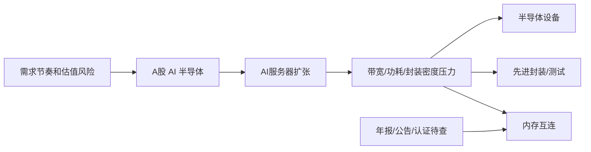

# Example: A-Share AI Semiconductor Canvas

## Human Summary

先排层级，再排公司。AI 半导体研究应优先看内存互连、高速 PCB/CCL、先进封装/测试、半导体设备和算力芯片生态。原因是这些层级更接近扩产、带宽、良率、客户认证和国产替代约束。

## Mermaid



## AI Patch

```json
{
  "version": 1,
  "intent": "Create an A-share AI semiconductor research map.",
  "operations": [
    {
      "op": "addNode",
      "id": "node-ashare-ai-semi",
      "title": "A股 AI 半导体",
      "summary": "先看带宽、封装、设备和算力生态的卡点。",
      "body": "研究目标：把 AI 服务器扩张拆成可验证的产业链约束，优先看扩产难、认证慢、客户绕不开的层级。",
      "tags": ["industry", "AI-semiconductor"],
      "status": "seed",
      "x": 0,
      "y": 0
    },
    {
      "op": "addNode",
      "id": "node-memory-interconnect",
      "title": "内存互连",
      "summary": "AI 服务器带宽升级带来接口和认证约束。",
      "body": "证据待查：年报产品结构、客户认证、DDR5/MRCD/MDB/CXL 相关披露、毛利率和订单变化。",
      "tags": ["layer", "bottleneck", "memory"],
      "status": "exploring",
      "x": 380,
      "y": -120,
      "connectFromId": "node-ashare-ai-semi",
      "edgeKind": "contains",
      "edgeLabel": "layer"
    }
  ]
}
```

## Evidence Gaps

- 需要公告和年报确认收入占比。
- 需要客户认证或订单证据。
- 需要财务质量验证：毛利率、应收、库存、经营现金流。
