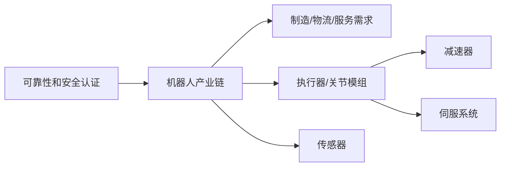

# Example: Robotics Chain Canvas

## Human Summary

机器人产业链不要先从整机公司看起。更稳的路径是先拆执行器、减速器、伺服、传感器、控制器、安全认证和真实场景数据，再判断哪些环节扩产慢、认证难、客户切换成本高。

## Mermaid

## Canvas Notes

- `contains`: 机器人产业链 -> 执行器/传感器/软件/应用。
- `blocks`: 可靠性认证 -> 下游落地。
- `supports`: 订单、客户认证、产能记录 -> 公司节点。
- `questions`: 成本下降、客户可替代性、毛利率不兑现 -> 公司节点。

## Evidence Gaps

- 量产客户和认证进度。
- 关键零部件自制率。
- 毛利率是否能证明卡点控制力。
